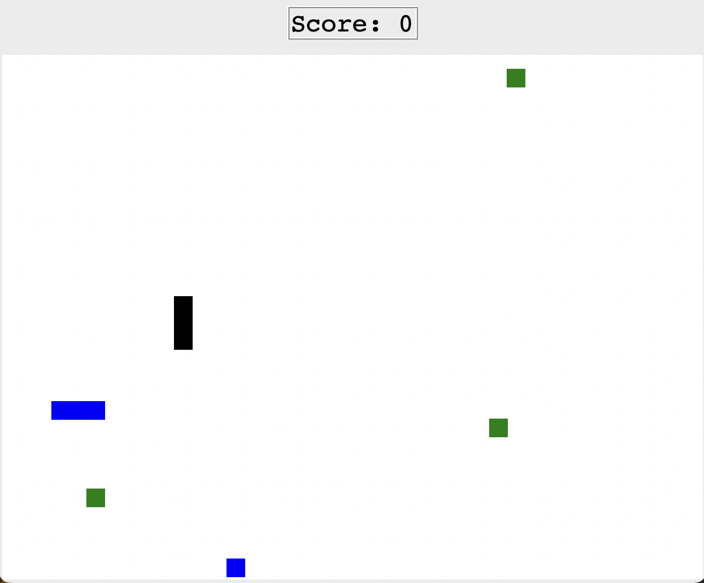

# Snake Game

An interactive Boggle word game built in Python.
The player searches for valid words on a randomized board of letters before the timer runs out. Words are validated against a dictionary, and the score updates dynamically as you play.

  
  

## 🎮 How to Play

- When the game starts, a **random board of letters** is generated.  
- Click **adjacent** letters to form words. 
- **Valid** words will appear in the list on the right, and your **score** updates.  
- You have a limited amount of **time** to find as many words as possible.  
- Press **Play** restart the game. 
