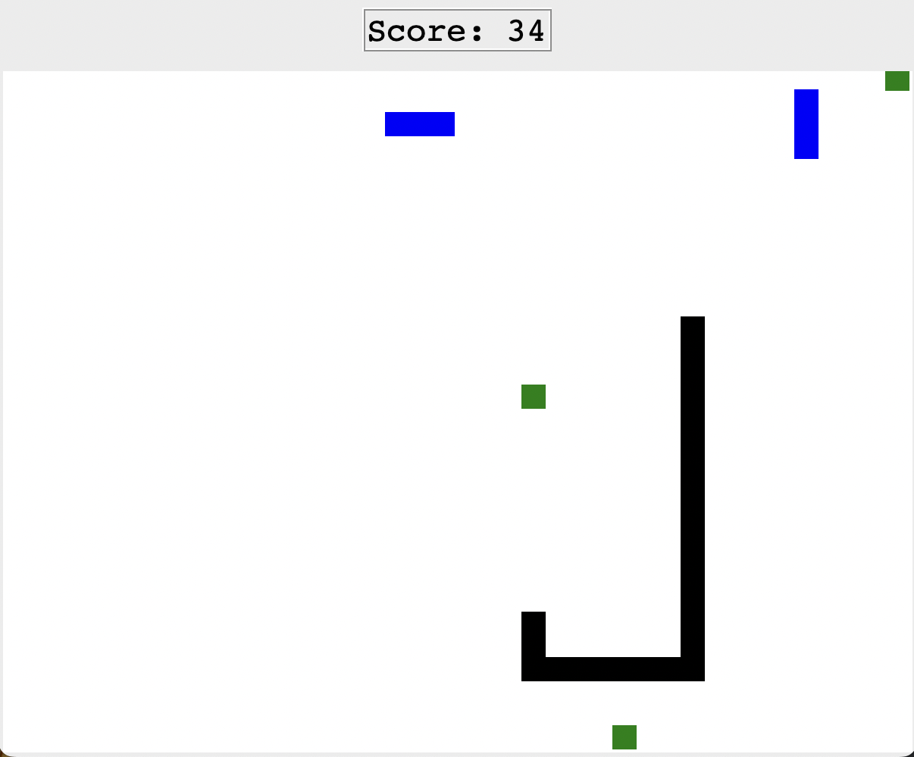

# Snake Game

An interactive Snake game built in Python.

  
  

## 🎮 How to Play

- Use the **arrow keys** (↑ ↓ ← →) to control the snake’s movement.  
- Eat the **green apples** to grow longer and increase your score.  
- Avoid running into the **walls**, into the **snake’s own body** or get hit in the head by the **enemy snake** — doing so ends the game.  
